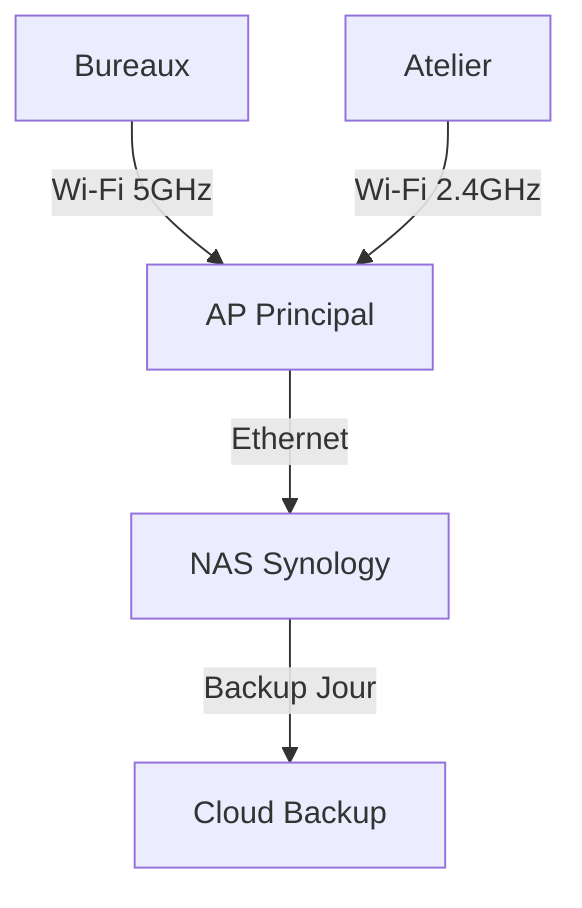

# Contributing Guide - METALIS Project

Merci de contribuer au projet de modernisation infrastructure METALIS ! 🛠️

## 📋 Avant de Commencer

- Consultez [README.md](README.md) pour comprendre le contexte
- Vérifiez les **Issues ouvertes** pour ne pas dupliquer le travail
- Rejoignez le **Slack/Teams** du projet pour coordination

---

## 🤝 Processus de Contribution

### 1. **Créer une Branch**

```bash
git checkout -b feature/ma-feature
# ou
git checkout -b bugfix/mon-bug
# ou
git checkout -b docs/ma-documentation
```

**Convention de nommage :**

- `feature/xxx` - Nouvelle fonctionnalité
- `bugfix/xxx` - Correction de bug
- `docs/xxx` - Documentation
- `chore/xxx` - Maintenance/configuration
- `test/xxx` - Tests PRA, charge, validation

### 2. **Faire vos Modifications**

⚠️ **RÈGLES CRITIQUES** :

1. **❌ JAMAIS de données sensibles** :
   - Pas de mots de passe, tokens, API keys
   - Pas d'IP réelles, domaines internes
   - Pas de données client (commandes, devis)
   - Utiliser `.env.template` pour configs

2. **✅ Documentation toujours à jour** :
   - Mettre à jour README si changement
   - Ajouter commentaires pour logique complexe
   - Documenter décisions dans `/docs`

3. **✅ Suivre les conventions du projet** :
   - Indentation : 2 espaces (yaml) ou 4 espaces (code)
   - Noms fichiers : `kebab-case`
   - Commit messages : clair et détaillé

### 3. **Tester Localement**

```bash
# Valider syntaxe YAML/JSON
yamllint *.yaml
jq . < config.json

# Valider Markdown
markdownlint docs/*.md

# Tests PRA (si script)
./scripts/restore/restore-test.sh --dry-run

# Tests charge E-Commerce
./tests/load_tests/woocommerce-load.sh --test
```

### 4. **Commit & Push**

```bash
# Commits atomiques, clairs
git add <fichiers-modifiés>
git commit -m "feat: add NAS redundancy with Synology RAID6

- Configurer RAID 6 sur NAS principal
- Setup snapshot automatique toutes les 6h
- Documenter recovery en docs/ARCHITECTURE.md
- Refs #89"

git push origin feature/ma-feature
```

### 5. **Créer une Pull Request**

Template de PR :

```markdown
## Description

[Résumé changements]

### Type Changement

- [ ] Bugfix (correction sans breaking change)
- [ ] Feature (nouvelle fonctionnalité)
- [ ] Documentation
- [ ] Infrastructure
- [ ] Test/Validation

### Changements

- Item 1
- Item 2

### Checklist

- [ ] Pas de données sensibles
- [ ] Tests passent
- [ ] Docs à jour
- [ ] Impact PRA évalué
- [ ] Pas de breaking changes

### Lien Issues

Closes #89
Related to #76
```

### 6. **Code Review & Merge**

- **Minimum 1 approbation** pour merger
- Address reviewers feedback
- Une fois approuvé : **merge et delete branch**

---

## 📝 Guidelines Documentation

### Structure

- **README** = contexte + quick start
- **ARCHITECTURE.md** = design cible, tech stack
- **REQUIREMENTS.md** = exigences métier/techniques
- **AUDIT_FINDINGS.md** = état actuel, problèmes
- **PRA_PCA_PLAN.md** = stratégie continuité
- **CAO_STRATEGY.md** = stockage SolidWorks
- **WIFI_DEPLOYMENT.md** = plan Wi-Fi atelier

### Format

```markdown
# Titre (h1)

## Sous-titre (h2)

- Point 1
- Point 2

| Component | Current | Target |
| --------- | ------- | ------ |
| NAS       | 2TB     | 8TB    |

> ⚠️ Note importante
```

### Diagrams Mermaid



---

## 🐛 Reporting Bugs

1. Vérifier si déjà reporté (Issues)
2. Créer Issue avec :
   - **Titre** : "E-Commerce plante lors promo Janvier"
   - **Description** : contexte, reproductibilité
   - **Impact** : revenue loss ? production down ?
   - **Logs/Evidence** : captures, metrics
   - **Frequency** : aléatoire ? reproductible ?

Template :

```markdown
## Description Bug

[Le problème]

## Reproduction

1. Faire X
2. Puis Y
3. Observer Z

## Comportement Attendu

[Ce qui devrait se passer]

## Comportement Actuel

[Ce qui se passe]

## Environnement

- OS: [e.g. Ubuntu 20.04]
- Hardware: [e.g. NAS Synology DS920+]
- Version Odoo: [e.g. 15.0]
- Version WooCommerce: [e.g. 6.5]

## Logs/Evidence

[Logs serveur, captures d'écran, metrics]

## Impact

- Revenue Loss Estimé: [€/h]
- Nombre Utilisateurs Impactés: [N]
- Criticité: 🔴 Arrêt Production / 🟠 Dégradé / 🟡 Mineur
```

---

## 💡 Proposer des Améliorations

1. Créer une **Discussion** (pas Issue)
2. Décrire :
   - **Problème actuel**
   - **Solution proposée**
   - **Bénéfices** (performance, coût, stabilité)
   - **Effort/Coûts**
   - **Risques**
3. Recueillir feedback avant Issue

Exemple : "_Migrer WooCommerce vers Shopify pour meilleures performances ?_"

---

## 🔒 Sécurité & Conformité

### Avant chaque Commit

```bash
# Vérifier aucun secret
git diff --cached | grep -E "(password|secret|key|token|api)" && echo "⚠️ Secrets!"

# Vérifier fichiers sensibles
git ls-files -o --exclude-standard | grep -E "(\.pem|\.key|\.env|credentials)" && echo "⚠️ Config!"
```

### Secrets Accidentels ?

1. **IMMÉDIATEMENT** → `.env.template` (sans valeur)
2. Notifier RSSI
3. Rotate tokens/passwords
4. `git filter-branch` nettoyage historique

---

## 📊 Metrics & Monitoring

### Valider Déploiement

```bash
# Check NAS capacité/santé
./scripts/monitoring/nas-health.sh

# Check Wi-Fi signal strength
./scripts/monitoring/wifi-coverage.sh

# Check E-Commerce performance
./tests/load_tests/woocommerce-load.sh --benchmark

# Check PRA readiness
./tests/pra_drills/backup-restore-test.sh
```

---

## 📚 Ressources Utiles

- [Odoo Docs](https://www.odoo.com/documentation/)
- [WooCommerce Docs](https://woocommerce.com/documentation/)
- [Synology DSM Guide](https://www.synology.com/en-us/dsm/support)
- [Markdown Syntax](https://www.markdownguide.org/)
- [Mermaid Diagrams](https://mermaid.live/)

---

## 🆘 Besoin d'Aide ?

- **Questions projet ?** → Issues + Discussions
- **Technique Odoo ?** → Docs Odoo + Slack technique
- **Infrastructure ?** → Slack #infra
- **Sécurité ?** → Contact RSSI

---

## ✅ Checklist Avant Merge

- [ ] Pas de secrets, IP, données sensibles
- [ ] Tests PRA passent (backup/restore valide)
- [ ] Documentation à jour (README, docs/)
- [ ] Logs/metrics attachés si bug fix
- [ ] Commit messages clairs
- [ ] Branche à jour avec `main`
- [ ] ≥1 approbation code review
- [ ] Pas de conflits

---

**Merci pour votre contribution !** 🚀
